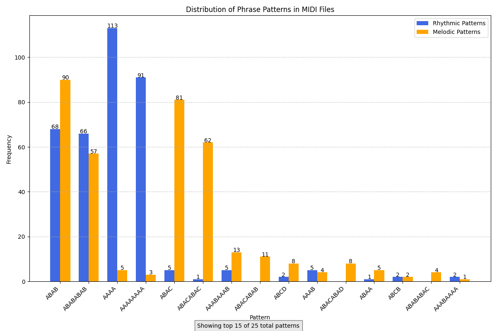
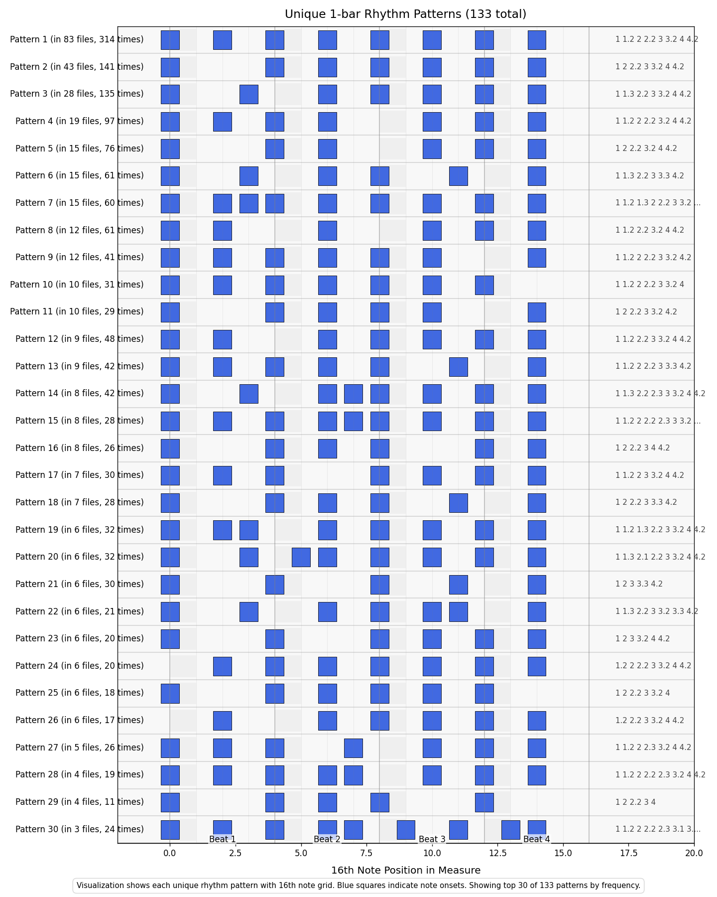
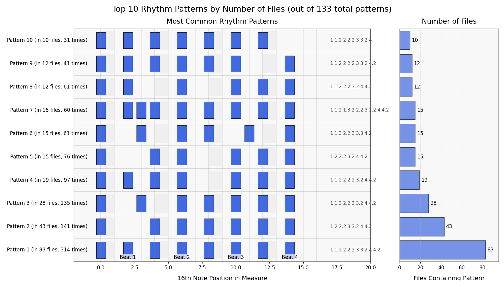

# MIDI Phrase Analyzer

A Python tool for analyzing rhythmic and melodic patterns in MIDI files. This tool extracts and visualizes musical patterns, helping musicians, composers, and music theorists understand the structure of music pieces.

## Features

- **Rhythm Pattern Analysis**: Analyzes note onset patterns and identifies rhythmic structures
- **Melodic Pattern Analysis**: Examines note sequences and detects recurring melodic patterns
- **Section Identification**: Detects musical sections based on pattern changes 
- **Form Visualization**: Displays the overall musical form using letter notation (e.g., AABA)
- **Note Range Analysis**: Shows the range of notes used in the composition
- **Rhythmic Density Calculation**: Computes the average number of notes per measure
- **JSON Metadata Generation**: Creates a JSON metadata file for each MIDI file with phrasal information
- **Chart Visualization**: Creates graphical representations of patterns, including:
  - Pattern distribution bar charts comparing rhythmic and melodic patterns
  - Detailed grid visualization of unique rhythm patterns
  - Summary charts of the most common rhythm patterns with frequency information

## Installation

1. Clone this repository:
```bash
git clone https://github.com/ajdemarco95/midi-phrase-analyzer.git
cd midi-rhythm-analyzer
```

2. Create and activate a virtual environment (recommended):
```bash
python -m venv .venv
source .venv/bin/activate  # On Windows: .venv\Scripts\activate
```

3. Install dependencies:
```bash
pip install -r requirements.txt
```

## Usage

### Analyzing a Single MIDI File

Use `analyze_midi_data.py` to analyze a single MIDI file:

```bash
python analyze_midi_data.py path/to/your/file.mid
```

### Analyzing Multiple MIDI Files

Use `process_midi_files.py` to recursively analyze all MIDI files in a directory:

```bash
python process_midi_files.py path/to/midi/directory
```

## Example Output

```
================================================================================
Processing: midi/melody.mid
================================================================================

--- RHYTHM PHRASAL STRUCTURE ANALYSIS ---
Total measures: 4
Total duration: 1984 ticks (15.50 quarter notes)

--- COMBINED RHYTHM AND MELODIC ANALYSIS ---
The rhythmic and melodic patterns differ:
  Rhythmic: AAAA
  Melodic:  ABAB

Note range: E3 to D4
Rhythmic density: 7.00 onsets per measure

Overall melodic form: ABAB

Created metadata file: midi/melody.json
```

## Metadata Files

For each MIDI file processed, the tool generates a corresponding JSON metadata file that contains the phrasal information:

```json
{
    "phrasal": {
        "rhythmic": {
            "pattern": "AAAA"
        },
        "melodic": {
            "pattern": "ABAB"
        }
    }
}
```

These metadata files can be useful for:
- Batch processing and categorizing MIDI files
- Integration with other music analysis tools
- Database storage of musical pattern information
- ML/AI training for pattern recognition

## Chart Visualizations

The tool generates several types of visualizations to help understand musical patterns:

### Pattern Distribution Chart

A grouped bar chart showing the distribution of rhythmic and melodic phrase patterns across analyzed MIDI files. This visualization helps identify which patterns are most common in your collection.



### Rhythm Pattern Visualization

A detailed grid visualization showing unique 1-bar rhythm patterns found in the analyzed MIDI files. Each pattern is displayed on a 16th note grid with:
- Blue squares indicating note onsets
- Clear indication of beat positions
- Frequency information (number of files containing each pattern and total occurrences)



### Rhythm Pattern Summary

A combined visualization showing:
- Grid representation of the most common rhythm patterns
- Bar chart displaying the frequency of each pattern (by number of files or total occurrences)



All charts are automatically saved to a `stats` directory for easy reference.

## How It Works

1. The tool parses MIDI files using the `mido` library to extract note events
2. It analyzes the timing of note onsets to identify rhythmic patterns
3. It examines the pitch sequence of notes to detect melodic patterns
4. It compares measures to identify repeated sections
5. It maps the patterns to letter notation (A, B, C, etc.) to visualize the musical form
6. It generates charts and visualizations to help understand the patterns

## Requirements

- Python 3.6+
- mido 1.2.10+
- matplotlib (for visualization features)

## License

This project is licensed under the MIT License - see the LICENSE file for details.

## Contributing

Contributions are welcome! Please feel free to submit a Pull Request.

## Acknowledgments

- Thanks to the creators of the mido library for making MIDI file processing easier
- Inspired by music theory analysis techniques used by composers and theorists 